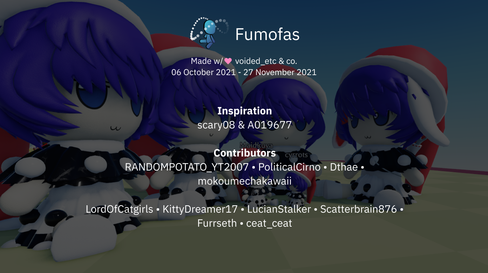

## Licensing

### Assets

All character assets are copyright (c) scary08 and/or their original creators.

Most assets in this project are not created by me. You should seek explicit permission by their creators if you intend to use them.

Contact me if you wish to use any of them, and I will try to get you permission.

### Code

All code in this project is covered under the MIT license.

```
Copyright © 2022 voided_etc & co.

Permission is hereby granted, free of charge, to any person obtaining a copy of this software and associated documentation files (the “Software”), to deal in the Software without restriction, including without limitation the rights to use, copy, modify, merge, publish, distribute, sublicense, and/or sell copies of the Software, and to permit persons to whom the Software is furnished to do so, subject to the following conditions:

The above copyright notice and this permission notice shall be included in all copies or substantial portions of the Software.

THE SOFTWARE IS PROVIDED “AS IS”, WITHOUT WARRANTY OF ANY KIND, EXPRESS OR IMPLIED, INCLUDING BUT NOT LIMITED TO THE WARRANTIES OF MERCHANTABILITY, FITNESS FOR A PARTICULAR PURPOSE AND NONINFRINGEMENT. IN NO EVENT SHALL THE AUTHORS OR COPYRIGHT HOLDERS BE LIABLE FOR ANY CLAIM, DAMAGES OR OTHER LIABILITY, WHETHER IN AN ACTION OF CONTRACT, TORT OR OTHERWISE, ARISING FROM, OUT OF OR IN CONNECTION WITH THE SOFTWARE OR THE USE OR OTHER DEALINGS IN THE SOFTWARE.
```

## Development

All scripts are managed by Rojo (6.2.0). Follow the instructions on [the website](https://rojo.space/) if you wish to use it.

Copies of each script are already present in the .rbxl.
If you simply wish to edit them in Roblox, you should not need to set up Rojo.
It is important in this case to isolate the .rbxl and never use Rojo with the project, otherwise modified scripts may be overriden.

### Plugins

- [Moon Animator 2](https://www.roblox.com/library/4725618216/Moon-Animator-2)
- [Tag Editor](https://www.roblox.com/library/948084095/Tag-Editor)
- [Building Tools by F3X](https://www.roblox.com/library/144950355/Building-Tools-by-F3X-Plugin)
- [Material Icons](https://www.roblox.com/library/6045494621/Material-Icons)
- and Rojo

### Project Structure

- `src/` - Source files used by Rojo. You can delete these if you don't want to use Rojo.
- `default.project.json` - Rojo config. You can delete it if you don't want to use Rojo.
- `Fumofas.rbxl` - The main project file.
- `assets/`
  - `A.pdn` and `Ca2.pdn` - paint.net projects for eye styles which I have split into layers and made cleaner. Originals were not by me.